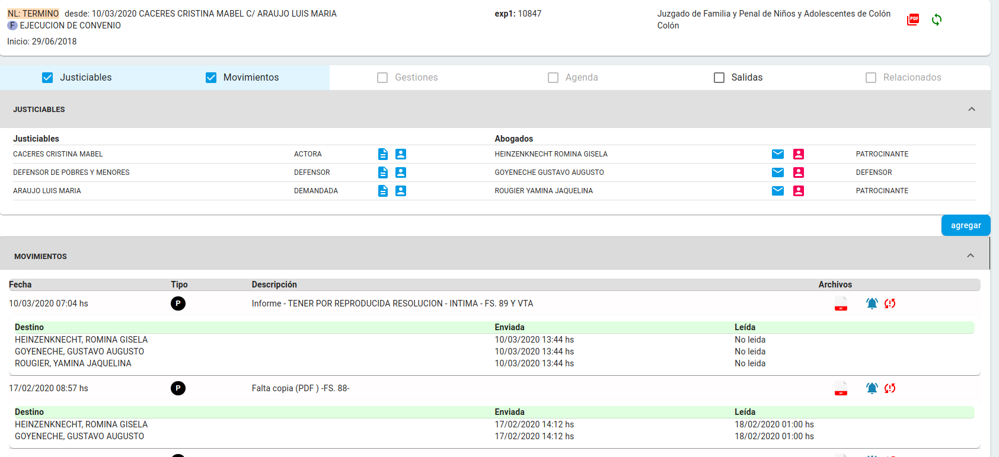
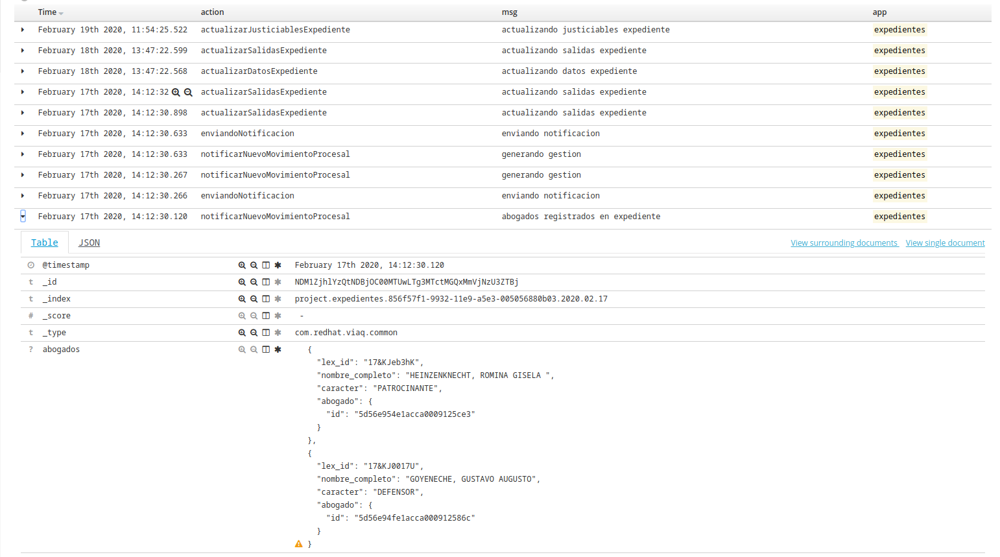
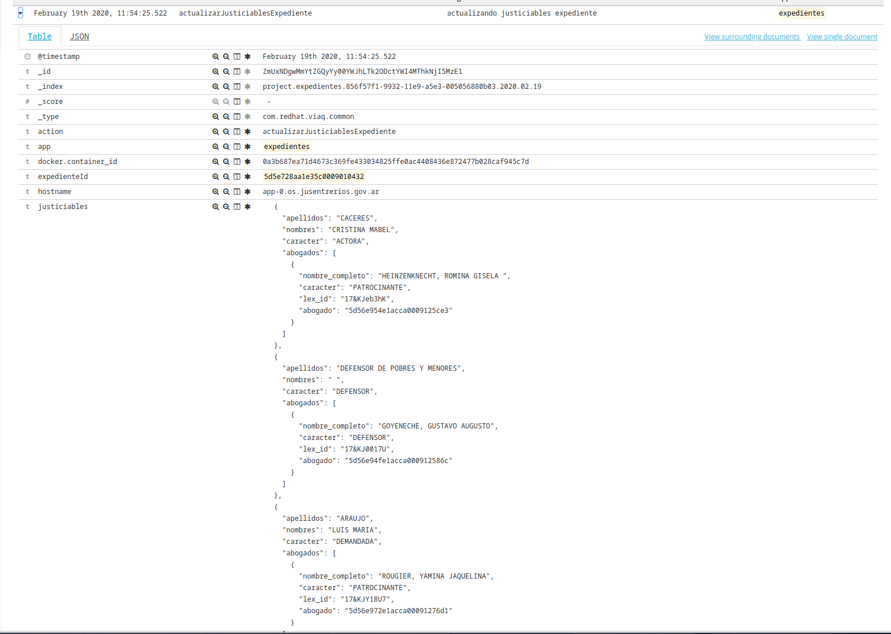
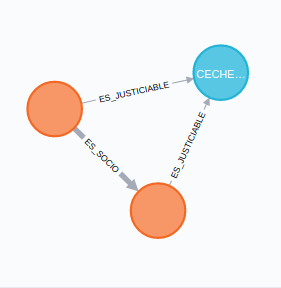

```{r setup, include=FALSE}
knitr::opts_chunk$set(echo = FALSE)
```

# Área de desarrollo

## Equipo

Equipos heterogenos en constante búsqueda de integración

> Experiencia en diferentes tecnologías de base


# Situacion Inicial

## Estado

* Sin gobernanza de datos
* BD oscuras
* Software propietario de terceros

# Situacion Actual

## Estado

* Desarrollos propios
* BD centralizada y transparente
* Accesso para sincronización BD organismos

## Mesa Virtual

[Acceso Mesa Virtual](https://mesavirtual.jusentrerios.gov.ar/expedientes/5e67b8756afa4c000940a270)

[Ejemplo Documento](./documento_prueba.pdf)


## Ejemplo Operaciones



## al momento de notificar 



## se agrega un abogado




# Lo que viene...

## Corto Plazo

* [EJEMPLO_SIRIRI](http://stj-siriri.aplicaciones-dev.jusentrerios.gov.ar/expedientes/5e67b8756afa4c000940a270)
* Integración SGP
* Desarrollos Servicios Personas y Calendarios
* Editor Textos judiciales (con soporte para modelos de escrito)
* Microgestión de expedientes (resoluciones, gestion audiencias) 

## Mediano Plazo

* Integración Inveniet
* Modelado de expedientes según proceso

## Largo Plazo

* Análisis de datos



[Grafo de Pertenencia](http://stj-siriri.aplicaciones-dev.jusentrerios.gov.ar/justiciables/grafoPertenencia)

* Gestión asistida (IA)
